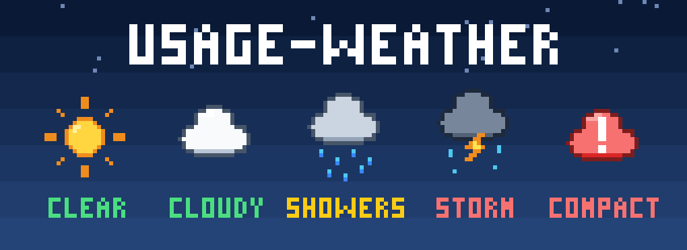
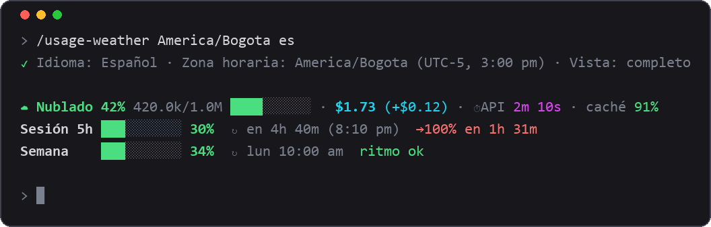
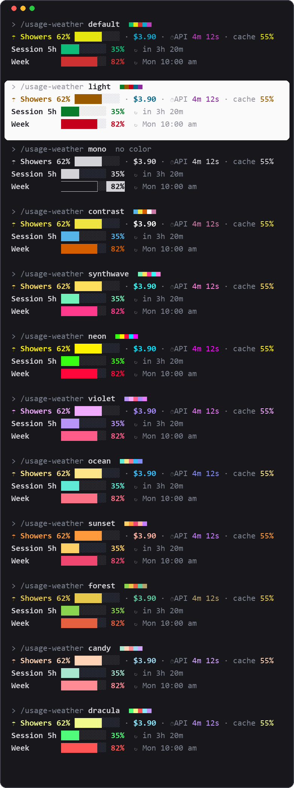

# usage-weather

<p align="center"></p>

Un pronóstico del clima para tu uso de Claude Code, dibujado encima del prompt: ventana de contexto, costo de la sesión, caché y los límites de tu plan Pro/Max, con la hora de reinicio **en tu zona horaria y en tu idioma**.

English: [README.md](README.md)



<sub>Las vistas previas son renders dibujados con el formato real de salida del mod (cifras de ejemplo), no capturas de pantalla.</sub>

## Qué muestra

| Fila | Contenido |
|---|---|
| 1 | Pronóstico del contexto (Despejado < 25%, Nublado < 50%, Lluvia < 75%, Tormenta < 90%, Compacta ya ≥ 90%), tokens usados / ventana y una barra de progreso real; costo equivalente en API y lo que costó el último turno; tiempo aproximado en API; porcentaje de caché del último turno, y tras Σ el de toda la sesión si es distinto (baja tras /compact o una pausa, que es cuando cuesta plata; verde ≥ 80%, amarillo ≥ 50%, rojo por debajo). |
| 2 | Límite de sesión de 5 h: barra, porcentaje, tiempo restante y hora de reinicio. |
| 3 | Límite semanal: barra, porcentaje, día y hora de reinicio. |

- Las barras de límites son verdes por debajo de 50%, amarillas por debajo de 80% y rojas desde 80%.
- **Ritmo**: con al menos 5 minutos de datos, `→100% en 2h 10m` si la ventana se llenaría antes de reiniciarse, o `ritmo ok` si no.
- **Avisos** (toasts), una sola vez cada uno: contexto al 75% (considera `/compact`) y al 90% (compacta ya); cada límite al 80% y al 90%.
- Las cuentas regresivas avanzan cada minuto aunque no escribas.
- Las filas 2 y 3 solo aparecen con suscripción Pro/Max, después de la primera respuesta del modelo. Con una clave de API normal solo ves la fila 1.
- El "costo" es el *costo equivalente en API*. Con suscripción es lo que habría costado la sesión, no dinero gastado.

## Instalación

```text
/plugin marketplace add AndersonDavi/claude-mods
/plugin install usage-weather@andersondavi-mods
/reload-plugins
```

Si no aparece, reinicia Claude Code. Se dibuja en la terminal y en la pestaña Code de la app de escritorio.

**Requisitos:** un Claude Code con soporte de mods (probado en la 2.1.287; mira la tuya con `claude --version`). Hace falta una suscripción Pro/Max para las dos filas de límites.

> Un mod ejecuta código dentro de Claude Code con el mismo acceso que Claude Code. Lee el código antes de instalarlo (`hooks/register.tsx`, unas 800 líneas; sin llamadas de red, sin acceso a archivos ni al entorno: solo guarda su configuración en el almacén propio de Claude Code para el plugin).

## Configuración: `/usage-weather`

Todo es un solo comando. Las palabras pueden ir en cualquier orden; si una no se reconoce, no cambia nada.

```text
/usage-weather                       muestra la configuración actual
/usage-weather ja                    idioma
/usage-weather Asia/Tokyo            zona horaria
/usage-weather America/Bogota es     zona horaria + idioma
/usage-weather synthwave             tema de color
/usage-weather mini                  vista de una fila (completo | mini | oculto)
/usage-weather zonas                 lista de zonas horarias
/usage-weather idiomas               lista de idiomas
/usage-weather temas                 lista de temas de color
/usage-weather test                  vista previa del tema: lecturas falsas de calma a casi lleno
```

La configuración se guarda y se recuerda entre sesiones. El idioma por defecto es inglés; la zona horaria se detecta del sistema. La primera vez, un mensaje corto explica cómo cambiarlos (y sugiere el idioma de tu sistema si es uno de los ocho).

### Idiomas

`es` Español · `en` English · `pt` Português · `fr` Français · `de` Deutsch · `zh` 中文 · `ja` 日本語 · `ko` 한국어

Las etiquetas en chino, japonés y coreano se alinean según su ancho real. Español e inglés muestran la hora en am/pm; el resto en 24 h.

¿Falta el tuyo? Un idioma es una sola entrada en una tabla: mira [CONTRIBUTING](../CONTRIBUTING.md) (hay un resumen en español al final).

### Temas

12 temas de color, que se guardan como el resto de la configuración: `default` (los colores de tu terminal), `light` (para fondos claros), `mono` (sin color: negrita e inversión), `contrast` (apto para daltonismo), `synthwave`, `neon`, `violet`, `ocean`, `sunset`, `forest`, `candy` y `dracula`. Usan colores de 24 bits; en una terminal que no los soporte se aproximan.

```text
/usage-weather neon
/usage-weather synthwave es
```



La palabra `test` (o `demo`, `preview`, `probar`) recorre la barra por cinco lecturas falsas, 1 s cada una, de calma a casi lleno, para ver todos los colores del tema actual; luego vuelve a tus números reales. Prueba `/usage-weather neon test`.

### Zonas horarias

Sirve cualquiera de estas formas:

- un nombre IANA, con horario de verano incluido: `America/Bogota`, `Europe/Madrid`, `Asia/Tokyo`, `America/New_York`;
- solo la ciudad: `bogota`, `tokyo`, `new_york`;
- un desfase fijo: `UTC-5`, `+5:30`, `utc`.

`/usage-weather zonas` imprime una lista lista para usar.

## Límites que debes conocer

- Los números semanal y de 5 h son de toda tu cuenta, pero el mod solo conoce el valor que llegó con la **última respuesta de esta sesión**. Si otra sesión gasta entre medias, la app de escritorio puede ir un punto adelante.
- El contexto y el costo son por sesión.
- `⏱API` es una aproximación (tiempo del turno menos el tiempo ejecutando herramientas y esperando permisos), no la cifra exacta de `/usage`.
- La caché cuenta desde que el mod cargó en la sesión.
- El *saldo de créditos de API* no está disponible para los mods: no viene en ninguna respuesta ni existe un endpoint público.

## Créditos y licencia

Inspirado en **token-weather**, de los ejemplos de mods de Claude Code (Claude Code DevRel, © 2026 Anthropic PBC, Apache-2.0). Este mod amplía la idea con costo, caché, límites del plan, avisos, idiomas y zonas horarias. Ver [NOTICE](NOTICE).

Licencia [Apache 2.0](LICENSE).
