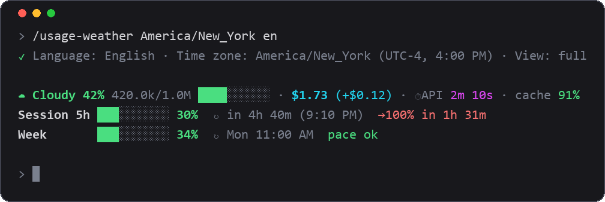
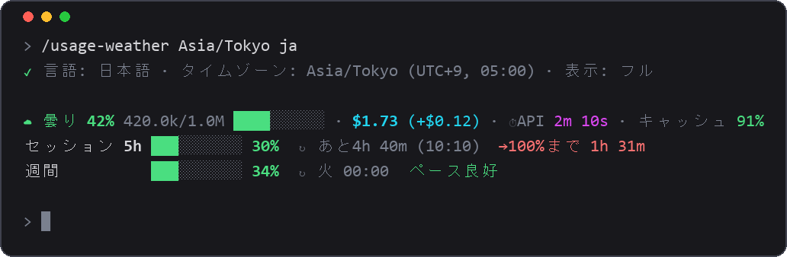

# usage-weather

<p align="center"></p>

A weather forecast for your Claude Code usage, drawn above the prompt: context window, session cost, cache hit rate and your Pro/Max plan limits, with the time they reset **in your own time zone and language**.

Español: [README.es.md](README.es.md)



<sub>Previews are renders drawn from the mod's real output format (sample numbers), not screenshots.</sub>

## What it shows

| Row | Content |
|---|---|
| 1 | Context forecast (Clear < 25%, Cloudy < 50%, Showers < 75%, Storm < 90%, Compact soon ≥ 90%), tokens used / window and a real progress bar; equivalent API cost and the last turn's cost; approximate API time; prompt-cache hit rate of the last turn, with the whole-session rate after Σ when it differs (it drops after /compact or a pause, which is when it costs money; green ≥ 80%, yellow ≥ 50%, red below). |
| 2 | 5-hour session limit: bar, percentage, time left and reset time. |
| 3 | Weekly limit: bar, percentage, reset day and time. |

- Limit bars are green below 50%, yellow below 80%, red from 80%.
- **Pace**: with at least 5 minutes of data, `→100% in 2h 10m` when the window would fill before it resets, `pace ok` otherwise.
- **Alerts** (toasts), once each: context at 75% (consider `/compact`) and 90% (compact now); each limit at 80% and 90%.
- Countdowns tick every minute, even if you are not typing.
- Rows 2 and 3 only appear on a Pro/Max subscription, after the first model response. On a plain API key you get row 1.
- "Cost" is the *equivalent API cost*. On a subscription it is what the session would have cost, not money spent.

## Install

```text
/plugin marketplace add AndersonDavi/claude-mods
/plugin install usage-weather@andersondavi-mods
/reload-plugins
```

If it does not show up, restart Claude Code. It draws in the terminal UI and in the Code tab of the desktop app.

**Requirements:** a Claude Code with mods support (tested on 2.1.287; check yours with `claude --version`). A Pro/Max subscription is needed for the two limit rows.

> A mod runs code inside Claude Code with the same access Claude Code has. Read the source before you install it (`hooks/register.tsx`, about 800 lines; no network calls, no file access and no environment access: it only keeps its settings in Claude Code's own per-plugin store).

## Settings: `/usage-weather`

Everything is one command. Words can come in any order; one unknown word changes nothing.

```text
/usage-weather                       show the current settings
/usage-weather ja                    language
/usage-weather Asia/Tokyo            time zone
/usage-weather America/Bogota es     time zone + language
/usage-weather synthwave             color theme
/usage-weather mini                  one-row view (full | mini | off)
/usage-weather themes                list color themes
/usage-weather test                  preview the theme: fake readings from calm to nearly full
/usage-weather zones                 list time zones
/usage-weather languages             list languages
```

Settings are saved and remembered across sessions. The default language is English; the time zone is detected from your system. On the first run a short message tells you how to change them (and suggests your system language if it is one of the eight).

### Languages

| Code | Language | Code | Language |
|---|---|---|---|
| `es` | Español | `zh` | 中文 |
| `en` | English | `ja` | 日本語 |
| `pt` | Português | `ko` | 한국어 |
| `fr` | Français | `de` | Deutsch |



Chinese, Japanese and Korean labels are aligned by display width. English and Spanish show times as AM/PM, the rest as 24 h.

Missing yours? A language is one table entry: see [CONTRIBUTING](../CONTRIBUTING.md).

### Themes

12 color themes, saved like the other settings: `default` (your terminal's own colors), `light` (for light backgrounds), `mono` (no color: weight and inversion), `contrast` (color-blind safe), `synthwave`, `neon`, `violet`, `ocean`, `sunset`, `forest`, `candy`, `dracula`. Themes use 24-bit colors; on a terminal without them the nearest colors are used.

```text
/usage-weather neon
/usage-weather synthwave es
```


The `test` word (also `demo` or `preview`) steps the bar through five fake readings, 2.5 s each, from calm to nearly full, so you can see every color of the current theme; then it returns to your real numbers. Try `/usage-weather neon test`.

### Time zones

Any of these works:

- an IANA name, with daylight saving handled: `America/Bogota`, `Europe/Madrid`, `Asia/Tokyo`, `America/New_York`;
- just the city: `bogota`, `tokyo`, `new_york`;
- a fixed offset: `UTC-5`, `+5:30`, `utc`.

`/usage-weather zones` prints a ready list.

## Limits you should know about

- The weekly and 5-hour numbers are your whole account's, but the mod only knows the value reported with the **last response of this session**. If another session spends in between, the desktop app may be one point ahead.
- Context and cost are per session.
- `⏱API` is an approximation (turn time minus time spent running tools and waiting for permission), not the exact figure from `/usage`.
- The cache rate counts from when the mod loaded in the session.
- The remaining *API credit balance* is not available to mods: it is not in any response and has no public endpoint.

## Credits and license

Inspired by **token-weather** from the Claude Code mods examples (Claude Code DevRel, © 2026 Anthropic PBC, Apache-2.0). This mod extends the idea with cost, cache, plan limits, alerts, languages and time zones. See [NOTICE](NOTICE).

Licensed under the [Apache License 2.0](LICENSE).
